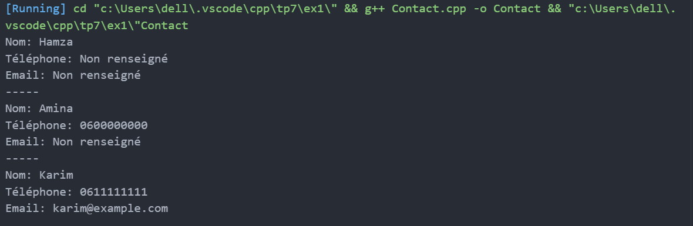
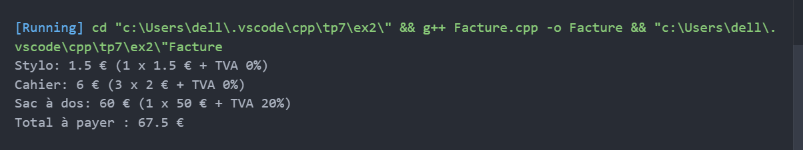
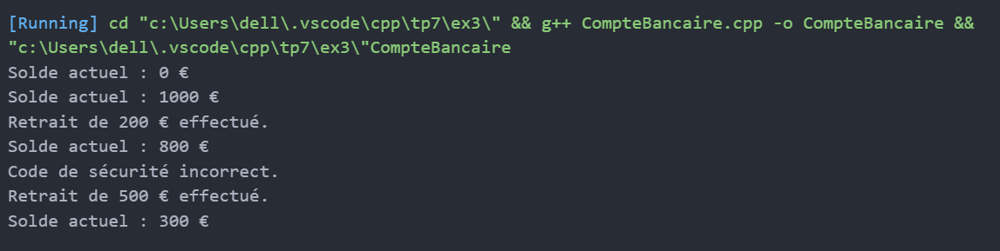

# TP7 : Programmation Orientée Objet en C++

## Exercice 1 — Carnet d’adresses  
Classe `Contact` avec constructeurs surchargés et méthode `afficher()`.  

## Exercice 2 — Facturation  
Classe `Facture` avec méthodes `ajouterArticle()` surchargées et total TTC.  

## Exercice 3 — Compte bancaire  
Classe `CompteBancaire` avec constructeurs et méthodes `retrait()` surchargés, gestion du solde.  

